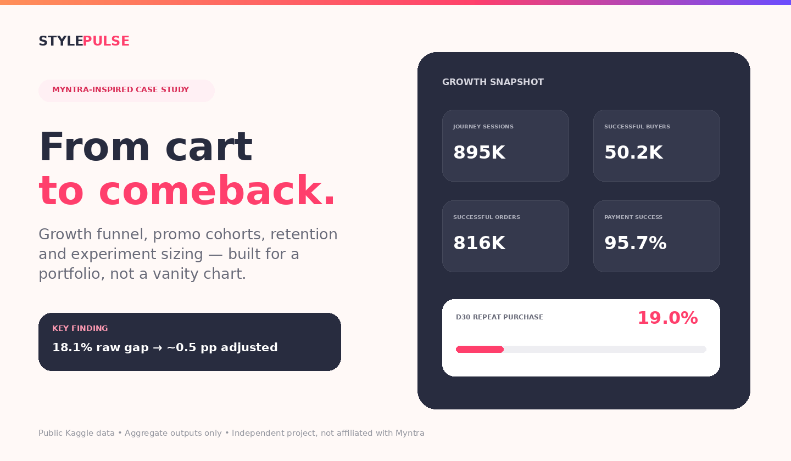

# StylePulse — Myntra-Inspired Growth Funnel & Retention Analytics

> **Portfolio case study:** AARRR funnel design, cohort retention, promo-vs-non-promo behavior, revenue quality, and growth experimentation for a fashion e-commerce product.
>
> **Independent project — not affiliated with Myntra.** The interface borrows the energy of Myntra's pink/orange fashion aesthetic, but uses no Myntra logo or proprietary data.



## Live dashboard

The repository is built as a **zero-build static site** (`index.html` + CSS + vanilla JavaScript), so it can be hosted directly on GitHub Pages. The dashboard includes interactive retention comparisons, cohort heatmaps, source/funnel breakdowns, and an experiment-sizing simulator.

After pushing the repository to GitHub, enable **Settings → Pages → Source: GitHub Actions**. The included workflow publishes the site automatically on every push to `main`.

---

## The business question

Fashion marketplaces often acquire a large share of first-time buyers through promotions. The easy conclusion is that sale-acquired customers are "low quality" because their raw repeat rate is lower.

This project asks a more useful set of questions:

1. Where does the commerce journey lose users?
2. How quickly do registered users reach their first successful purchase?
3. Do promo-acquired customers actually retain worse than non-promo customers?
4. How much of the observed retention gap is simply **cohort mix**?
5. What would be worth testing next — loyalty, lifecycle nudges, checkout work, or referral?

---

## Headline findings

| Metric | Result | What it means |
|---|---:|---|
| Registered customers | **100,000** | Full customer table |
| Journey sessions | **895,203** | Compressed from clickstream events |
| Successful buyers | **50,242** | 50.2% of registered customers ever complete a successful purchase |
| Successful orders | **815,964** | 95.7% of transactions succeed |
| Average successful order value | **550.3K source units** | No FX conversion applied |
| Ever-repeat buyer rate | **79.6%** | Across the full multi-year observation window |
| D30 repeat purchase — no promo | **20.3%** | Mature first-purchase cohorts only |
| D30 repeat purchase — promo | **16.7%** | Raw comparison |
| Raw promo retention gap | **3.7 pp / 18.1% relative** | Looks material at first glance |
| Cohort-adjusted gap | **0.5 pp** | Most of the raw difference is acquisition-month mix |

### The most important analytical finding

A naive comparison says first-purchase promo customers retain **18.1% worse on a relative basis** at D30: 16.7% vs 20.3%.

But customers were acquired in different calendar cohorts. After comparing promo and non-promo customers **within first-purchase month** and standardizing by promo-cohort size, the gap falls to only **~0.5 percentage points**.

**Decision:** do not cut discounting because of the raw retention chart. The data does **not** establish that promotions cause weaker retention. Run a randomized lifecycle/offer experiment instead.

That distinction — correlation vs cohort composition — is the core of the case study.

---

## AARRR framework

### Acquisition
- 100K registered customers.
- 90.0% of journey sessions are Mobile; 10.0% Web.
- Mobile and Web have almost identical payment-success rates and AOV, so device/source alone is not enough for budget allocation.
- **Next instrumentation:** campaign, creative, referrer, paid/organic and CAC fields.

### Activation
- 50.2% of registered customers eventually make at least one successful purchase.
- Among successful buyers, median signup → first successful purchase is **1.1 days**; P90 is **3.9 days**.
- The clickstream is transaction-centered, so its 97%+ add-to-cart rate should not be treated as a real marketplace top-of-funnel benchmark.

### Retention
- D30 cumulative repeat purchase: ~19.0% overall among mature first-purchase cohorts.
- Promo first-purchase cohort: 16.7%; no-promo: 20.3% raw.
- Month-standardized gap: only ~0.5 pp.
- 79.6% of successful buyers eventually repeat over the full observation window, suggesting the key challenge is **accelerating purchase #2**, not proving long-run loyalty exists.

### Revenue
- 815,964 successful orders.
- 449.0B source units in successful order value (GMV proxy).
- Average successful order value: 550.3K source units.
- Apparel contributes ~48% of successful-order merchandise value, Accessories ~25%, Footwear ~21%.

### Referral
Referral is **not observable**. There are no invite events, referrer IDs, invite codes or referred-user links.

Rather than inventing a viral coefficient, the project proposes the instrumentation required to measure it:
`invite_sent → invite_opened → invite_accepted → referred_signup → referred_order`.

---

## Recommended growth experiments

### 1. Accelerate the second purchase
**Audience:** first-time promo buyers.

**Treatment:** personalized category/wishlist reminder around D7–D14 + loyalty milestone before D30.

**Primary metric:** second successful purchase by D30.

**Guardrails:** AOV, discount cost per retained buyer, cancellation/failure rate.

The dashboard contains an interactive scenario model. At an **18% relative D30 lift** from the observed 16.7% promo baseline, the historical mature promo cohort would imply roughly **533 additional repeat buyers** and ~**295M source units** of second-order value. This is an **experiment-sizing scenario, not a causal forecast**.

### 2. Don't reduce promotions based on the raw retention gap
The unadjusted gap is highly confounded by acquisition month. Promo policy should be tested with randomized holdouts or a credible quasi-experimental design.

### 3. Reward purchase #2, not just acquisition
Long-run repeat is high. Shift some incentive budget from blanket first-order discounting toward a second-purchase loyalty milestone.

### 4. Instrument referral before optimizing it
Add referrer and invite linkage, then measure invite conversion, referred-buyer quality and K-factor.

### 5. Upgrade acquisition attribution
MOBILE vs WEB is too coarse. Add campaign/creative/channel cost so the growth team can optimize **retained CAC**, not just traffic volume.

---

## Interactive dashboard

The site is deliberately built without a heavy front-end framework so recruiters can open it instantly and GitHub Pages can host it for free.

Interactive elements include:

- Raw vs cohort-adjusted promo retention toggle
- D7 / D30 / D60 / D90 retention curves
- 2021 monthly cohort heatmap
- Retention-lift scenario slider
- Monthly order-value vs returning-buyer-value toggle
- Funnel and behavioral path visualization
- Promo-code cohort table
- Payment success and category-value views

**Design system:** Myntra-inspired pink `#FF3F6C`, orange `#FF905A`, dark ink `#282C3F`, purple accents and high-contrast fashion-commerce cards. No logo or proprietary design assets are copied.

---

## Data & methodology

**Source:** [E-commerce App Transactional Dataset — Aditya Bagus Pratama, Kaggle](https://www.kaggle.com/datasets/bytadit/transactional-ecommerce)

The Kaggle listing describes the dataset as intended for study/personal-portfolio use and lists a CC BY-NC-ND license. **Raw data is intentionally not included in this repository.** Only aggregated analytical outputs are committed.

Four source tables are used:

| Table | Role |
|---|---|
| `customer` | registration date, device, demographics |
| `product` | fashion catalog taxonomy |
| `click_stream` | session/journey events and traffic source |
| `transactions` | customer, session, payment status, promo, order value and product basket |

### Metric definitions

**Successful purchase:** `payment_status == "Success"`.

**Promo-acquired buyer:** `promo_amount > 0` on the customer's first successful purchase.

**D30 repeat purchase:** customer has a second successful purchase within 30 days of the first. Only first-purchase cohorts with a complete 30-day observation window are included.

**Cohort-adjusted promo comparison:** compute promo and no-promo D30 rates within each first-purchase calendar month, retain months with adequate observations in both groups, and weight month-level rates by promo-cohort size.

**Monthly retention heatmap:** non-cumulative share of each first-purchase cohort that makes at least one successful purchase in activity month M0–M6.

**Order value / GMV proxy:** sum of successful `total_amount`; the source field includes transaction-level payment amount and is shown in source units. It is not converted to INR.

**Category merchandise value:** `item_price × quantity` for successful transactions, before promo deduction.

Full definitions and caveats: [`analysis/methodology.md`](analysis/methodology.md).

---

## Important limitations

1. **This is not Myntra data.** It is a public e-commerce dataset used to answer a Myntra-style product/growth problem.
2. The clickstream is unusually transaction-centered: 95%+ journeys reach booking. Funnel conversion is therefore not a credible external benchmark.
3. `session_id` behaves more like a commerce journey than a conventional 30-minute analytics session.
4. The sale-vs-non-sale analysis is observational. Cohort adjustment reduces obvious calendar confounding but does not prove causality.
5. Referral cannot be measured from the supplied schema.
6. No CAC/ad-spend data exists, so true acquisition efficiency and LTV:CAC cannot be calculated.
7. Monetary values remain in source units; no FX conversion is performed.

Calling these out is intentional. A portfolio project is stronger when it knows what the data **cannot** prove.

---

## Repository structure

```text
.
├── index.html                       # Interactive GitHub Pages dashboard
├── assets/
│   ├── styles.css                   # Myntra-inspired responsive design system
│   ├── app.js                       # Charts, toggles, simulator, heatmap
│   ├── dashboard_data.js            # Aggregated data used by the static site
│   └── preview.png                  # README preview
├── analysis/
│   ├── build_metrics.py             # Reproducible metric pipeline
│   ├── prepare_clickstream.py       # Session aggregation for the large clickstream
│   ├── methodology.md               # Definitions and analytical caveats
│   └── outputs/                     # Small aggregated CSV/JSON outputs
├── notebooks/
│   └── growth_retention_case_study.ipynb
├── data/
│   └── README.md                    # How to obtain/place source data
├── docs/
│   ├── INTERVIEW_GUIDE.md
│   └── RESUME_BULLETS.md
└── .github/workflows/pages.yml      # Automatic GitHub Pages deployment
```

---

## Run locally

No build is required for the dashboard:

```bash
python -m http.server 8000
```

Then open `http://localhost:8000`.

To reproduce the metrics from source files:

```bash
pip install -r requirements.txt
python analysis/prepare_clickstream.py --input data/raw/click_stream.csv --output data/raw/clickstream_sessions.csv
python analysis/build_metrics.py --data-dir data/raw --output-dir analysis/outputs
```

---

## Deploy to GitHub Pages

1. Create a public GitHub repository and push this folder to `main`.
2. Open **Settings → Pages**.
3. Set **Source** to **GitHub Actions**.
4. The included `pages.yml` workflow will deploy the dashboard.
5. Put the resulting Pages URL on your resume; it is a better portfolio link than the repository URL alone.

---

## Resume-ready version

> **Growth Funnel & Retention Analytics — Fashion E-commerce** — Built a Myntra-inspired interactive growth dashboard over 895K customer journeys and 816K successful orders; modeled AARRR, D7–D90 purchase retention and promo cohorts. Found an apparent 18.1% relative D30 retention gap for promo-acquired buyers shrank to ~0.5 pp after cohort-month adjustment, preventing a misleading discount-retention conclusion; designed a lifecycle experiment and retention-lift sizing model.

Shorter variants are in [`docs/RESUME_BULLETS.md`](docs/RESUME_BULLETS.md).

---

## What I would add with real product telemetry

- campaign cost + CAC
- wishlist state/history
- push/email exposure and opens
- product recommendations served/clicked
- referral/referrer linkage
- cancellation/return/refund behavior
- experiment assignment tables
- session-level customer identity for non-purchasing sessions

Those fields would allow true retained-CAC, incremental promo lift, referral K-factor and causal lifecycle analysis.
